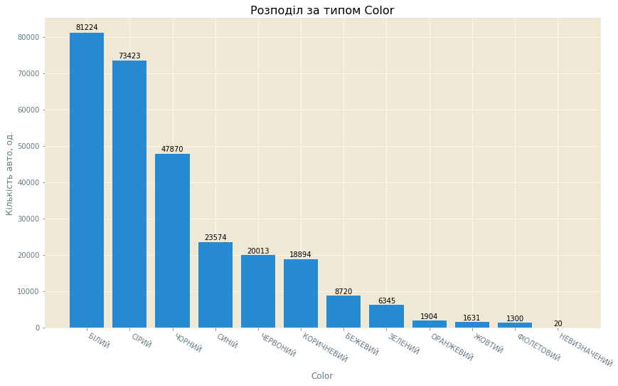
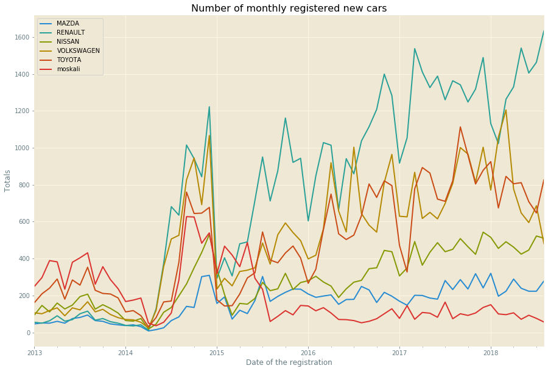
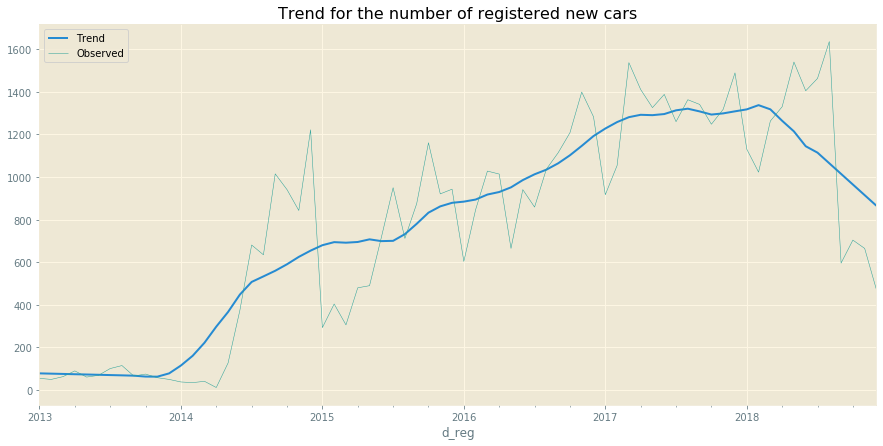
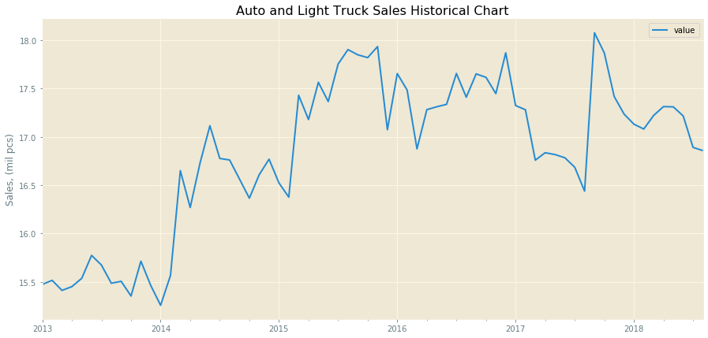
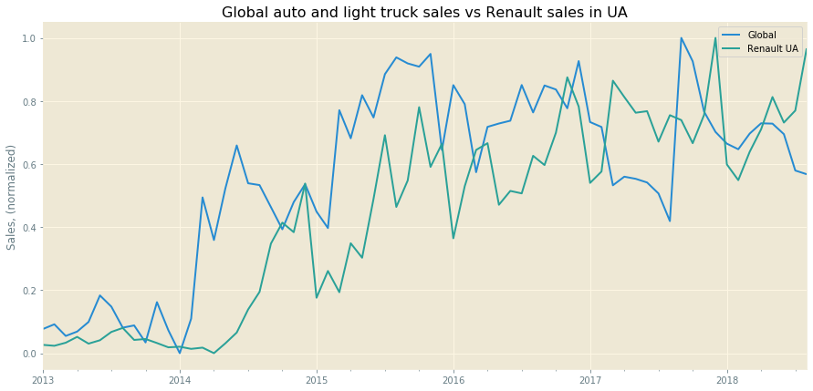
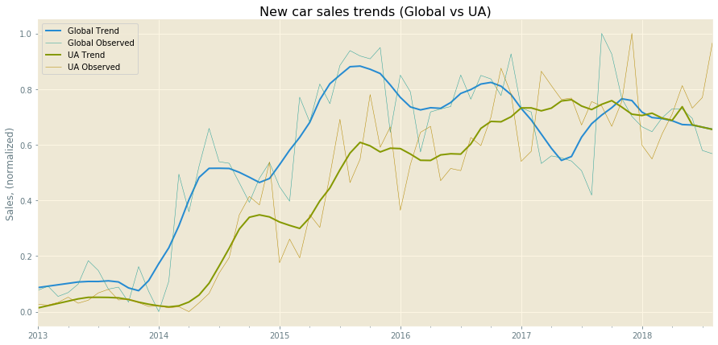

## Ukrainian automotive market 2013-2019 (tentative title)
***

Data is publically accessible at [Ukrainian Open Data Portal](https://data.gov.ua)

Anonymized annual datasets of [vehicle owners](https://data.gov.ua/en/dataset/06779371-308f-42d7-895e-5a39833375f0) for the period from 01-January-2013 till 12-October-2019 was used in analysis.
***

Questions to answer with this data (for the specific kind of transport):
1. Most popular brands with their top models
2. Preferred car colours
3. Local vs global trends over the time period
4. Vip car plates rating
5. Fuel and engine types
6. UA car owners map (visalization: brand/model per region of registration)
7. Most popular car bodies
***

### 1. Data export from CSV-files


```python
import pandas as pd
import numpy as np

from pprint import pprint

%timeit
```


```python
files = []
# files = !ls -d "$PWD"/datasets/* | grep tz_opendata # Absolute path
files = !ls -d ./datasets/* | grep tz_opendata # relative path
files
```


    ['./datasets/tz_opendata_z01012013_po31122013.csv',
     './datasets/tz_opendata_z01012014_po31122014.csv',
     './datasets/tz_opendata_z01012015_po31122015.csv',
     './datasets/tz_opendata_z01012016_po31122016.csv',
     './datasets/tz_opendata_z01012017_po31122017.csv',
     './datasets/tz_opendata_z01012018_po01012019.csv',
     './datasets/tz_opendata_z01012019_po01112019.csv']


```python
#    This Cell normally can be skipped.
#    It was used for TEST of the 2019 dataset having some incorrect data. 


#map_cols_dtypes = {'own_weight': np.float64,
#                   'OWN_WEIGHT': np.float64,
#                   'total_weight':np.float64,
#                   'TOTAL_WEIGHT':np.float64,
#                   'n_reg_new': object
#                  }

#df_ = pd.read_csv(files[6], sep=';', 
#                      parse_dates=['d_reg'], 
#                      index_col='d_reg', 
#                      low_memory=False,
#                      dtype=map_cols_dtypes,
#                      error_bad_lines=False,
#                     )


```


```python
# %timeit -r1 df = pd.read_csv(files[0], sep=';', parse_dates=['d_reg'], index_col='d_reg', low_memory=False)
# df = pd.read_csv(files[6], sep=';', parse_dates=['d_reg'], index_col='d_reg', low_memory=False)
```


```python
'''
    Export data from annual csv-files into one merged dataset.
    
    Original 2019 csv-file data cleaned manually before export. 
    Removed "," used as decimal separator in several columns.
'''

df = pd.DataFrame()

map_cols_dtypes = {'own_weight': np.float64,
                   'OWN_WEIGHT': np.float64,
                   'total_weight': np.float64,
                   'TOTAL_WEIGHT': np.float64,
                   'n_reg_new': object
                  }

for i, file in enumerate(files):
    df_ = pd.read_csv(file, sep=';', 
                      parse_dates=['d_reg'], 
                      index_col='d_reg',
                      skipinitialspace=True,
                      dtype=map_cols_dtypes,
                      error_bad_lines=False,
                     )
    
    df_.rename(str.capitalize, axis='columns', inplace=True)
    df = df.append(df_).sort_index()
    print("Finished loop {} of {} for file: {}".format(i+1, len(files), file))
    
print("All done!")
```

    Finished loop 1 of 7 for file: ./datasets/tz_opendata_z01012013_po31122013.csv
    Finished loop 2 of 7 for file: ./datasets/tz_opendata_z01012014_po31122014.csv
    Finished loop 3 of 7 for file: ./datasets/tz_opendata_z01012015_po31122015.csv
    Finished loop 4 of 7 for file: ./datasets/tz_opendata_z01012016_po31122016.csv
    Finished loop 5 of 7 for file: ./datasets/tz_opendata_z01012017_po31122017.csv
    Finished loop 6 of 7 for file: ./datasets/tz_opendata_z01012018_po01012019.csv
    Finished loop 7 of 7 for file: ./datasets/tz_opendata_z01012019_po01112019.csv
    All done!


```python
# Drop useless columns

df.drop(axis='columns', columns='Reg_addr_koatuu', inplace=True)
```


```python
# Strip models from records in "Brand" column. Models are stored in "Model" column.

df1 = df.copy()
df.Brand = df1.Brand.apply(lambda x: x.split('  ')[0])
```


```python
# Convert Make_year to datetime format

# df2 = df.copy()
# df2.Make_year = pd.to_datetime(df.Make_year, format='%Y', yearfirst=True)
```


```python
df.sample(3)
```


<div>
<style scoped>
    .dataframe tbody tr th:only-of-type {
        vertical-align: middle;
    }

    .dataframe tbody tr th {
        vertical-align: top;
    }

    .dataframe thead th {
        text-align: right;
    }
</style>
<table border="1" class="dataframe">
  <thead>
    <tr style="text-align: right;">
      <th></th>
      <th>Person</th>
      <th>Oper_code</th>
      <th>Oper_name</th>
      <th>Dep_code</th>
      <th>Dep</th>
      <th>Brand</th>
      <th>Model</th>
      <th>Make_year</th>
      <th>Color</th>
      <th>Kind</th>
      <th>Body</th>
      <th>Purpose</th>
      <th>Fuel</th>
      <th>Capacity</th>
      <th>Own_weight</th>
      <th>Total_weight</th>
      <th>N_reg_new</th>
    </tr>
    <tr>
      <th>d_reg</th>
      <th></th>
      <th></th>
      <th></th>
      <th></th>
      <th></th>
      <th></th>
      <th></th>
      <th></th>
      <th></th>
      <th></th>
      <th></th>
      <th></th>
      <th></th>
      <th></th>
      <th></th>
      <th></th>
      <th></th>
    </tr>
  </thead>
  <tbody>
    <tr>
      <td>2013-02-19</td>
      <td>P</td>
      <td>530</td>
      <td>530 - ЗНЯТТЯ З ОБЛIКУ ДЛЯ РЕАЛIЗАЦIЇ</td>
      <td>1363302</td>
      <td>(6302) ВРЕР ДАІ з обслуговування м. Харків  та...</td>
      <td>HONDA</td>
      <td>CIVIC</td>
      <td>2006</td>
      <td>БЕЖЕВИЙ</td>
      <td>ЛЕГКОВИЙ</td>
      <td>КОМБІ-B</td>
      <td>ЗАГАЛЬНИЙ</td>
      <td>БЕНЗИН</td>
      <td>1799.0</td>
      <td>1265.0</td>
      <td>1750.0</td>
      <td>21АІ9244</td>
    </tr>
    <tr>
      <td>2015-05-12</td>
      <td>P</td>
      <td>69</td>
      <td>69 - РЕЄСТРАЦІЯ ТЗ ПО АКТУ ПРИЙОМУ-ПЕРЕДАЧІ</td>
      <td>1371305</td>
      <td>(7105) ВРЕР ДАІ з обслуговування Золотоніськог...</td>
      <td>КРД</td>
      <td>050100</td>
      <td>2014</td>
      <td>СИНІЙ</td>
      <td>ПРИЧІП</td>
      <td>ПР-ЛЕГКОВИЙ-B</td>
      <td>ЗАГАЛЬНИЙ</td>
      <td>NaN</td>
      <td>NaN</td>
      <td>180.0</td>
      <td>750.0</td>
      <td>СА2651ХО</td>
    </tr>
    <tr>
      <td>2014-12-26</td>
      <td>P</td>
      <td>309</td>
      <td>309 - ПЕРЕРЕЄСТРАЦІЯ ТЗ НА НОВОГО ВЛАСНИКА ЗА ...</td>
      <td>1346301</td>
      <td>(4601) ВРЕР ДАІ з обслуговування  м. Львова та...</td>
      <td>HYUNDAI</td>
      <td>SANTA FE</td>
      <td>2006</td>
      <td>СІРИЙ</td>
      <td>ЛЕГКОВИЙ</td>
      <td>УНІВЕРСАЛ-B</td>
      <td>ЗАГАЛЬНИЙ</td>
      <td>ДИЗЕЛЬНЕ ПАЛИВО</td>
      <td>2188.0</td>
      <td>1760.0</td>
      <td>2520.0</td>
      <td>АН2458НР</td>
    </tr>
  </tbody>
</table>
</div>


```python
# Discover top values counted for each dataset parameter
top = 5

for c in df.columns:
    print('Top {} most popular values of the "{}":\n{}\n'.format(top, c, df[c].value_counts().head(top)))
```

    Top 5 most popular values of the <font color=red>"Person"</font>:
    P    9699385
    J    1101144
    Name: Person, dtype: int64
    
    Top 5 most popular values of the <font color=red>"Oper_code"</font>:
    315    1505636
    530    1300582
    40     1142319
    400     870893
    308     750805
    Name: Oper_code, dtype: int64
    
    Top 5 most popular values of the <font color=red>"Oper_name"</font>:
    530 - ЗНЯТТЯ З ОБЛIКУ ДЛЯ РЕАЛIЗАЦIЇ                                   1300546
    40 - ВТОРИННА РЕЄСТРАЦІЯ ТЗ, ПРИДБАНОГО В ТОРГОВЕЛЬНІЙ ОРГАНІЗАЦІЇ     1142105
    315 - ПЕРЕРЕЄСТРАЦІЯ ТЗ НА НОВ. ВЛАСН. ПО ДОГОВОРУ УКЛАДЕНОМУ В ТСЦ    1038547
    309 - ПЕРЕРЕЄСТРАЦІЯ ТЗ НА НОВОГО ВЛАСНИКА ЗА ДОВІДКОЙ-РАХУНОК          626814
    400 - ПЕРЕРЕЄСТРАЦIЯ ПРИ ПЕРЕОБЛАДНАННI БЕЗ ЗАМIНИ НОМЕРНИХ АГРЕГ.      595513
    Name: Oper_name, dtype: int64
    
    Top 5 most popular values of the <font color=red>"Dep_code"</font>:
    8046    167850
    4641    133013
    8044    127864
    6341    120586
    8041    117125
    Name: Dep_code, dtype: int64
    
    Top 5 most popular values of the <font color=red>"Dep"</font>:
    ТСЦ 8046                                                                              118260
    ТСЦ 4641                                                                              110773
    (6301) ВРЕР ДАІ з обслуговування м. Харків № 1 ГУМВС України в Харківській області    107008
    (4601) ВРЕР ДАІ з обслуговування  м. Львова та Пустомитівського району                104829
    Центр 8046                                                                            100054
    Name: Dep, dtype: int64
    
    Top 5 most popular values of the <font color=red>"Brand"</font>:
    ВАЗ              1163405
    VOLKSWAGEN        844394
    MERCEDES-BENZ     641351
    RENAULT           603500
    TOYOTA            440861
    Name: Brand, dtype: int64
    
    Top 5 most popular values of the <font color=red>"Model"</font>:
    LANOS          268867
    TRANSPORTER    167349
    PASSAT         149692
    KANGOO         146468
    AVEO           141811
    Name: Model, dtype: int64
    
    Top 5 most popular values of the <font color=red>"Make_year"</font>:
    2008    1147508
    2007    1075501
    2006     817497
    2013     638858
    2005     592139
    Name: Make_year, dtype: int64
    
    Top 5 most popular values of the <font color=red>"Color"</font>:
    СІРИЙ       2681954
    БІЛИЙ       2274339
    ЧОРНИЙ      1743980
    СИНІЙ       1354677
    ЧЕРВОНИЙ    1009529
    Name: Color, dtype: int64
    
    Top 5 most popular values of the <font color=red>"Kind"</font>:
    ЛЕГКОВИЙ     8163131
    ВАНТАЖНИЙ    1444549
    ПРИЧІП        346747
    АВТОБУС       269390
    МОТОЦИКЛ      239963
    Name: Kind, dtype: int64
    
    Top 5 most popular values of the <font color=red>"Body"</font>:
    СЕДАН-B                  3376510
    УНІВЕРСАЛ-B              2234930
    ХЕТЧБЕК-В                1421122
    ПАСАЖИРСЬКИЙ-B            712276
    ФУРГОН МАЛОТОНАЖНИЙ-B     615690
    Name: Body, dtype: int64
    
    Top 5 most popular values of the <font color=red>"Purpose"</font>:
    ЗАГАЛЬНИЙ          9806036
    СПЕЦІАЛІЗОВАНИЙ     881587
    СПЕЦІАЛЬНИЙ         112906
    Name: Purpose, dtype: int64
    
    Top 5 most popular values of the <font color=red>"Fuel"</font>:
    БЕНЗИН                4398474
    ДИЗЕЛЬНЕ ПАЛИВО       3428458
    БЕНЗИН АБО ГАЗ        2334508
    ЕЛЕКТРО                 27635
    ЕЛЕКТРО АБО БЕНЗИН      24102
    Name: Fuel, dtype: int64
    
    Top 5 most popular values of the <font color=red>"Capacity"</font>:
    1598.0    527952
    1498.0    429553
    1596.0    377582
    1998.0    284567
    1461.0    273124
    Name: Capacity, dtype: int64
    
    Top 5 most popular values of the <font color=red>"Own_weight"</font>:
    1050.0    168469
    1100.0    128115
    1250.0    115756
    1200.0     99464
    1060.0     97801
    Name: Own_weight, dtype: int64
    
    Top 5 most popular values of the <font color=red>"Total_weight"</font>:
    3500.0    378849
    1595.0    261230
    1395.0    221029
    1460.0    159475
    1400.0    140617
    Name: Total_weight, dtype: int64
    
    Top 5 most popular values of the <font color=red>"N_reg_new"</font>:
    АА1234АР    36
    СЕ1000МІ    31
    СЕ9413ВС    28
    АА1234ОТ    27
    05ЮЮ0001    26
    Name: N_reg_new, dtype: int64
    


```python
vip_plates = [
    '1111', '2222', '3333', '4444', '5555', '6666', '7777', '8888', '9999',
    '0001', '0002', '0003', '0004', '0005', '0006', '0007', '0008', '0009',
    '7000', '7700', '7770', '0777', '0077',
    '0666','0066', '6660',
    '8998', '9889', '3443', '4334', '1881',
    '1234', '0123',
]

vip_plates_number = {}

for p in vip_plates:
    cnt = df[df.N_reg_new.str.contains(p, na=False)].Person.count()
    vip_plates_number[p] = cnt
    #print('Plate "{}" found in DB {} times'.format(p, cnt))
```


```python
start_from = 0
step = 30

till_rank = start_from + step

rank = start_from + 1

for p, cnt in sorted(vip_plates_number.items(), key=lambda kv: kv[1], reverse=True)[start_from:till_rank]:
    print('Rank ({}): Plate "{}" used {} times'.format(rank, p, cnt))
    rank += 1
```

    Rank (1): Plate "0001" used 5103 times
    Rank (2): Plate "7777" used 4988 times
    Rank (3): Plate "8888" used 4477 times
    Rank (4): Plate "0777" used 4087 times
    Rank (5): Plate "7770" used 3663 times
    Rank (6): Plate "7000" used 3292 times
    Rank (7): Plate "1111" used 3131 times
    Rank (8): Plate "0077" used 2752 times
    Rank (9): Plate "9999" used 2588 times
    Rank (10): Plate "0007" used 2462 times
    Rank (11): Plate "1234" used 2215 times
    Rank (12): Plate "3333" used 1902 times
    Rank (13): Plate "5555" used 1879 times
    Rank (14): Plate "7700" used 1846 times
    Rank (15): Plate "4444" used 1844 times
    Rank (16): Plate "2222" used 1735 times
    Rank (17): Plate "0066" used 1609 times
    Rank (18): Plate "0123" used 1598 times
    Rank (19): Plate "0008" used 1518 times
    Rank (20): Plate "8998" used 1515 times
    Rank (21): Plate "1881" used 1494 times
    Rank (22): Plate "0003" used 1468 times
    Rank (23): Plate "0666" used 1453 times
    Rank (24): Plate "0002" used 1431 times
    Rank (25): Plate "0005" used 1409 times
    Rank (26): Plate "9889" used 1407 times
    Rank (27): Plate "3443" used 1321 times
    Rank (28): Plate "4334" used 1285 times
    Rank (29): Plate "0009" used 1143 times
    Rank (30): Plate "6660" used 1131 times


```python

```

### EDA of exported dataset


```python
df.info()
```

    <class 'pandas.core.frame.DataFrame'>
    DatetimeIndex: 10800529 entries, 2013-01-01 to 2019-12-10
    Data columns (total 17 columns):
    Person          object
    Oper_code       int64
    Oper_name       object
    Dep_code        int64
    Dep             object
    Brand           object
    Model           object
    Make_year       int64
    Color           object
    Kind            object
    Body            object
    Purpose         object
    Fuel            object
    Capacity        float64
    Own_weight      float64
    Total_weight    float64
    N_reg_new       object
    dtypes: float64(3), int64(3), object(11)
    memory usage: 1.4+ GB


```python
df.isnull().sum()
```


    Person               0
    Oper_code            0
    Oper_name            0
    Dep_code             0
    Dep                  0
    Brand                0
    Model                0
    Make_year            0
    Color                0
    Kind                 0
    Body                 0
    Purpose              0
    Fuel            579258
    Capacity        606305
    Own_weight       80237
    Total_weight     12027
    N_reg_new       109642
    dtype: int64


```python
df.Oper_name[df.N_reg_new.isnull()].unique()[:20]
```


    array(['540 - ЗНЯТТЯ З ОБЛIКУ У ЗВ`ЯЗКУ З ВИБРАКОВКОЮ',
           '530 - ЗНЯТТЯ З ОБЛIКУ ДЛЯ РЕАЛIЗАЦIЇ',
           "500 - ЗНЯТТЯ З ОБЛІКУ У ЗВ'ЯЗКУ ЗІ СКАСУВАННЯМ РЕЄСТРАЦІЇ",
           '550 - ЗНЯТТЯ З ОБЛIКУ ТЗ ВВЕЗЕНОГО ПIД ЗОБОВ. ПРО ЗВОР. ВИВЕЗЕННЯ',
           "542 - ЗНЯТТЯ З ОБЛІКУ У ЗВ'ЯЗКУ З УТІЛІЗАЦІЄЮ",
           '256 -  АНУЛЮВАННЯ ВИДАЧI ТИМЧАС. РЕЕСТР. ТАЛОНУ ПО ЗАЯВI ВЛ',
           '540 -  ЗНЯТТЯ З ОБЛIКУ У ЗВ`ЯЗКУ З ВИБРАКОВКОЮ',
           '550 -  ЗНЯТТЯ З ОБЛIКУ ТЗ ВВЕЗЕНОГО ПIД ЗОБОВ. ПРО ЗВОР. ВИВЕЗЕННЯ',
           '309 - ПЕРЕРЕЄСТРАЦІЯ ТЗ НА НОВОГО ВЛАСНИКА ЗА ДОВІДКОЙ-РАХУНОК',
           '510 - ЗНЯТТЯ З ОБЛІКУ ПРИ ЗМІНІ МІСЦЯ ПРОЖИВАННЯ В МЕЖАХ УКРАЇНИ',
           '501 - АНУЛЮВАННЯ ЗНЯТТЯ З ОБЛІКУ ТЗ',
           "343 - ПЕРЕРЕЄСТРАЦІЯ У ЗВ'ЯЗКУ ІЗ ЗМІНОЮ ДАНИХ ВЛАСНИКА АБО ТЗ ОТРИМАНОГО ЧЕРЕЗ ВІДДІЛ СОЦЗАХИСТУ",
           '560 -  ЗНЯТТЯ З ОБЛІКУ ПРИ ПОВЕРНЕННІ ІЗ ПОЇЗДКИ ЗА КОРДОН ПО ДОРУЧ.',
           '310 - ПЕРЕРЕЄСТРАЦІЯ НА НОВОГО ВЛАСНИКА ЗА ДОГ. КУПIВЛI-ПРОДАЖУ',
           '331 - ПЕРЕРЕЄСТРАЦІЯ ТЗ НА НОВОГО ВЛАСНИКА ЗА АКТОМ ПРОВЕДЕНОГО АУКЦІОНУ',
           '536 - ЗНЯТТЯ З ОБЛІКУТЗ (ДОГОВІР УКЛАДЕНИЙ В ТСЦ)',
           '40 - ВТОРИННА РЕЄСТРАЦІЯ ТЗ, ПРИДБАНОГО В ТОРГОВЕЛЬНІЙ ОРГАНІЗАЦІЇ',
           '255 -  АНУЛЮВАННЯ ВИДАЧI ТИМЧАС. РЕЄСТРАЦIЙНОГО ТАЛОНУ ПО ДОРУЧ',
           '501 - СКАСУВАННЯ ЗНЯТТЯ З ОБЛІКУ ТЗ',
           '502 -  СКАСУВАННЯ ПЕРЕРЕЄСТРАЦІЇ'], dtype=object)


```python
# Export DataFrame with cleaned data to csv-file

# df.to_csv('UA_TZ_registration_licenses_01-01-2013_01-01-2019.csv')
```


```python
# Example of search for a specific car

df_cx5 = df[(df['Brand'] == 'MAZDA') 
   & (df['Model'] == 'CX-5')
   & (df['Fuel'] == 'ДИЗЕЛЬНЕ ПАЛИВО')
   & (df['Make_year'] == 2015)
   & (df['Color'] == 'СІРИЙ')
   & (df['N_reg_new'].str.contains('7379', na=False))
      ]
df_cx5
```


<div>
<style scoped>
    .dataframe tbody tr th:only-of-type {
        vertical-align: middle;
    }

    .dataframe tbody tr th {
        vertical-align: top;
    }

    .dataframe thead th {
        text-align: right;
    }
</style>
<table border="1" class="dataframe">
  <thead>
    <tr style="text-align: right;">
      <th></th>
      <th>Person</th>
      <th>Oper_code</th>
      <th>Oper_name</th>
      <th>Dep_code</th>
      <th>Dep</th>
      <th>Brand</th>
      <th>Model</th>
      <th>Make_year</th>
      <th>Color</th>
      <th>Kind</th>
      <th>Body</th>
      <th>Purpose</th>
      <th>Fuel</th>
      <th>Capacity</th>
      <th>Own_weight</th>
      <th>Total_weight</th>
      <th>N_reg_new</th>
    </tr>
    <tr>
      <th>d_reg</th>
      <th></th>
      <th></th>
      <th></th>
      <th></th>
      <th></th>
      <th></th>
      <th></th>
      <th></th>
      <th></th>
      <th></th>
      <th></th>
      <th></th>
      <th></th>
      <th></th>
      <th></th>
      <th></th>
      <th></th>
    </tr>
  </thead>
  <tbody>
    <tr>
      <td>2015-12-05</td>
      <td>P</td>
      <td>100</td>
      <td>100 - ПЕРВИННА РЕЄСТРАЦIЯ ТЗ ПРИДБАНОГО В ТОРГ...</td>
      <td>8043</td>
      <td>Центр 8043</td>
      <td>MAZDA</td>
      <td>CX-5</td>
      <td>2015</td>
      <td>СІРИЙ</td>
      <td>ЛЕГКОВИЙ</td>
      <td>УНІВЕРСАЛ-B</td>
      <td>ЗАГАЛЬНИЙ</td>
      <td>ДИЗЕЛЬНЕ ПАЛИВО</td>
      <td>2191.0</td>
      <td>1570.0</td>
      <td>2050.0</td>
      <td>АА7379ОХ</td>
    </tr>
  </tbody>
</table>
</div>


```python
# Who is the new owner of ex-mine Fabia?

df[
    (df['N_reg_new'].str.startswith('АЕ', na=False)) 
   & (df['Brand'] == 'SKODA')
   & (df.Model == 'FABIA')
    & (df.Color == 'СІРИЙ')
    & (df.Make_year == 2008)
  ]['2016-1']
```


```python
# Top road police service operation codes

top_codes = df.groupby('Oper_code').Person.count().sort_values(ascending=False)[:10]
top_codes
```


    Oper_code
    530    1300581
    40     1142308
    315    1038547
    400     755255
    309     628457
    100     502587
    308     423199
    310     334103
    70      295156
    440     238817
    Name: Person, dtype: int64


```python
df.Oper_name[df.Oper_name.str.contains('ЗНЯТТЯ', na=False)].unique()
```


    array(['530 - ЗНЯТТЯ З ОБЛIКУ ДЛЯ РЕАЛIЗАЦIЇ',
           '534 - ЗНЯТТЯ З ОБЛІКУ ЗА АКТОМ ПРИЙОМА-ПЕРЕДАЧІ',
           '560 -  ЗНЯТТЯ З ОБЛІКУ ПРИ ПОВЕРНЕННІ ІЗ ПОЇЗДКИ ЗА КОРДОН ПО ДОРУЧ.',
           '540 - ЗНЯТТЯ З ОБЛIКУ У ЗВ`ЯЗКУ З ВИБРАКОВКОЮ',
           '533 - ЗНЯТТЯ З ОБЛIКУ ЗА ДОГОВОРОМ ДАРУВАННЯ ЧИ ЗАПОВІТОМ',
           '510 - ЗНЯТТЯ З ОБЛІКУ ПРИ ЗМІНІ МІСЦЯ ПРОЖИВАННЯ В МЕЖАХ УКРАЇНИ',
           "500 - ЗНЯТТЯ З ОБЛІКУ У ЗВ'ЯЗКУ ЗІ СКАСУВАННЯМ РЕЄСТРАЦІЇ",
           '520 - ЗНЯТТЯ З ОБЛIКУ ПРИ ВИЇЗДІ ЗА КОРДОН НА ПОСТ. МІСЦЕ ПРОЖИВ.',
           '143 - ПОНОВЛЕННЯ РЕЄСТР. ПІСЛЯ УМОВН. ЗНЯТТЯ З ОБЛ. З НЕПР. ТО',
           '570 - ЗНЯТТЯ З ОБЛІКУ У ЗВ`ЯЗКУ ЗI ЗМIНОЮ ОРГАНУ РЕЄСТРАЦІЇ',
           '531 - ЗНЯТТЯ З ОБЛIКУ ЗА ДОГОВОРОМ КУПIВЛI-ПРОДАЖУ',
           '550 - ЗНЯТТЯ З ОБЛIКУ ТЗ ВВЕЗЕНОГО ПIД ЗОБОВ. ПРО ЗВОР. ВИВЕЗЕННЯ',
           '532 - ЗНЯТТЯ З ОБЛIКУ ЗА ДОГОВОРОМ МІНИ',
           '500 - ЗНЯТТЯ З ОБЛІКУ У ЗВ`ЯЗКУ З АНУЛЮВАННЯМ РЕЄСТРАЦІЇ',
           '554 - ЗНЯТТЯ З ОБЛІКУ ТЗ ЗА АКТОМ ПРИЙОМУ-ПЕРЕДАЧІ',
           "552 - ЗНЯТТЯ ТЗ З ОБЛІКУ,ВВЕЗЕНОГО ПІД ЗОБОВ'ЯЗАННЯ ПРО ЗВОРОТНЕ ВИВЕЗЕННЯ",
           '561 -  ЗНЯТТЯ З ОБЛIКУ ПРИ ЗАКIНЧЕННI ТЕРМIНУ ДОРУЧЕННЯ',
           '541 - УМОВНЕ ЗНЯТТЯ З ОБЛІКУ У ЗВ`ЯЗКУ З НЕПРОХОДЖЕННЯМ ТО',
           '53 - ЗНЯТТЯ ТЗ З ОБЛІКУ ЗА РІШЕННЯМ СУДУ',
           '501 - АНУЛЮВАННЯ ЗНЯТТЯ З ОБЛІКУ ТЗ',
           "553 - ЗНЯТТЯ ТЗ З ОБЛІКУ,ВВЕЗЕНОГО ПІД ЗОБОВ'ЯЗАННЯ ПРО ЗВОРОТНЕ ВИВЕЗЕННЯ",
           '580 - ЗНЯТТЯ З ОБЛІКУ ТЗ ДЛЯ ПОВЕРНЕННЯ ОРГАНАМ СОЦ. ЗАХИСТУ',
           '550 -  ЗНЯТТЯ З ОБЛIКУ ТЗ ВВЕЗЕНОГО ПIД ЗОБОВ. ПРО ЗВОР. ВИВЕЗЕННЯ',
           '560 - ЗНЯТТЯ З ОБЛІКУ ПРИ ПОВЕРНЕННІ ІЗ ПОЇЗДКИ ЗА КОРДОН ПО ДОРУЧ.',
           "542 - ЗНЯТТЯ З ОБЛІКУ У ЗВ'ЯЗКУ З УТІЛІЗАЦІЄЮ",
           '570 - ЗНЯТТЯ З ОБЛІКУ У ЗВ`ЯЗКУ ЗI ЗМIНОЮ ДЕРЖАВНОГО ОРГАНУ РЕЄСТРАЦІЇ',
           '530 -  ЗНЯТТЯ З ОБЛIКУ ДЛЯ РЕАЛIЗАЦIЇ',
           '540 -  ЗНЯТТЯ З ОБЛIКУ У ЗВ`ЯЗКУ З ВИБРАКОВКОЮ',
           '534 -  ЗНЯТТЯ З ОБЛІКУ ЗА АКТОМ ПРИЙОМА-ПЕРЕДАЧІ',
           '535 - ЗНЯТТЯ З ОБЛІКУ ЗА ДОГОВОРОМ ФІНАНСОВОГО ЛІЗИНГУ',
           '500 - ЗНЯТТЯ З ОБЛІКУ У ЗВ`ЯЗКУ З СКАСУВАНЯМ РЕЄСТРАЦІЇ',
           '536 - ЗНЯТТЯ ТЗ ПО ДОГОВОРУ УКЛАДЕНОМУ В ТСЦ',
           '536 - ЗНЯТТЯ З ОБЛІКУТЗ (ДОГОВІР УКЛАДЕНИЙ В ТСЦ)',
           '536 - УМОВНЕ ЗНЯТТЯ ТЗ З ОБЛІКУ ДЛЯ ПЕРЕРЕЄСТРАЦІЇ НА НОВОГО ВЛАСНИКА ПО ДОГОВОРУ УКЛ. В ТСЦ',
           '570 - ЗНЯТТЯ З ОБЛІКУ У ЗВ`ЯЗКУ ЗI ЗМIНОЮ ДЕРЖАВНОГ ОРГАНУ РЕЄСТРАЦІЇ',
           '501 - СКАСУВАННЯ ЗНЯТТЯ З ОБЛІКУ ТЗ',
           '322 - ПЕРЕРЕЄСТРАЦIЯ ТЗ НА НОВ. ВЛАС. ПО УСПАДКУВАННЮ ЗА ЗАКОНОМ ЧИ ЗНЯТТЯМ З ОБЛІКУ В ОРГАНАХ СОЦЗАХИСТУ',
           '520 - ЗНЯТТЯ З ОБЛIКУ ПРИ ВИВЕЗЕНІ ЗА КОРДОН',
           '520 - ЗНЯТТЯ З ОБЛIКУ ПРИ ВИВЕЗЕННІ ЗА КОРДОН'], dtype=object)


```python
# Registration codes and names

for n, code in enumerate(top_codes.index, start=1):
    print('Category {}:\n{}\n'.format(n, df.Oper_name[df.Oper_code == code].unique()))
```

    Category 1:
    ['530 - ЗНЯТТЯ З ОБЛIКУ ДЛЯ РЕАЛIЗАЦIЇ'
     '530 -  ЗНЯТТЯ З ОБЛIКУ ДЛЯ РЕАЛIЗАЦIЇ']
    
    Category 2:
    ['40 - ВТОРИННА РЕЄСТРАЦІЯ ТЗ, ПРИДБАНОГО В ТОРГОВЕЛЬНІЙ ОРГАНІЗАЦІЇ'
     '40 -  ВТОРИННА РЕЄСТРАЦІЯ ТЗ, ПРИДБАНОГО В ТОРГОВЕЛЬНІЙ ОРГАНІЗАЦІЇ']
    
    Category 3:
    ['315 - ПЕРЕРЕЄСТРАЦІЯ ТЗ НА НОВ. ВЛАСН. ПО ДОГОВОРУ УКЛАДЕНОМУ В ТСЦ']
    
    Category 4:
    ['400 - ПЕРЕРЕЄСТРАЦIЯ ПРИ ПЕРЕОБЛАДНАННI БЕЗ ЗАМIНИ НОМЕРНИХ АГРЕГ.'
     '400 - ПЕРЕРЕЄСТРАЦIЯ ПРИ ПЕРЕОБЛАДНАННI БЕЗ ЗАМІНИ НОМЕРНИХ АГРЕГАТІВ'
     '400 - ПЕРЕРЕЄСТРАЦIЯ ПРИ ПЕРЕОБЛАДНАННI ДЛЯ РОБОТИ НА ГАЗОВОМУ ПАЛЬНОМУ'
     '400 -  ПЕРЕРЕЄСТРАЦIЯ ПРИ ПЕРЕОБЛАДНАННI БЕЗ ЗАМIНИ НОМЕРНИХ АГРЕГ.']
    
    Category 5:
    ['309 - ПЕРЕРЕЄСТРАЦІЯ ТЗ НА НОВОГО ВЛАСНИКА ЗА ДОВІДКОЙ-РАХУНОК'
     '309 - ПЕРЕРЕЄСТРАЦІЯ ТЗ НА НОВОГО ВЛАСНИКА ЗА ДОВІДКОЮ-РАХУНКОМ'
     '309 -  ПЕРЕРЕЄСТРАЦІЯ ТЗ НА НОВОГО ВЛАСНИКА ЗА ДОВІДКОЙ-РАХУНОК']
    
    Category 6:
    ['100 - ПЕРВИННА РЕЄСТРАЦIЯ ТЗ ПРИДБАНОГО В ТОРГІВЕЛЬНІЙ ОРГАНІЗАЦІЇ, УСТАНОВИ'
     '100 - ПЕРВИННА РЕЄСТРАЦIЯ ТЗ ПРИДБАНОГО В ТОРГІВЕЛЬНІЙ ОРГАНІЗАЦІЇ, ЯКИЙ ВВЕЗЕНО З-ЗА КОРДОНУ'
     '100 -  ПЕРВИННА РЕЄСТРАЦIЯ ТЗ ПРИДБАНОГО В ТОРГІВЕЛЬНІЙ ОРГАНІЗАЦІЇ, УСТАНОВИ'
     '100 - ПЕРВИННА РЕЄСТРАЦIЯ Б/В ТЗ ПРИДБАНОГО В ТОРГІВЕЛЬНІЙ ОРГАНІЗАЦІЇ, ЯКИЙ ВВЕЗЕНО З-ЗА КОРДОНУ']
    
    Category 7:
    ['308 - ПЕРЕРЕЄСТРАЦІЯ НА НОВОГО ВЛАСНИКА ЗА ДОГ. КУПIВЛI-ПРОДАЖУ (СГ)']
    
    Category 8:
    ['310 - ПЕРЕРЕЄСТРАЦІЯ НА НОВОГО ВЛАСНИКА ЗА ДОГ. КУПIВЛI-ПРОДАЖУ'
     '310 - ПЕРЕРЕЄСТРАЦІЯ НА НОВОГО ВЛАСНИКА ЗА ДОГ. КУП.-ПРОД.(ОФОРМ.НОТАРІАЛЬНО ТА ІНШ.)'
     '310 - ПЕРЕРЕЄСТРАЦІЯ НА НОВОГО ВЛАСНИКА ЗА ДОГ. КУП.-ПРОД.ТА ІНШ.(ОФОРМ.НОТАРІАЛЬНО )'
     '310 -  ПЕРЕРЕЄСТРАЦІЯ НА НОВОГО ВЛАСНИКА ЗА ДОГ. КУПIВЛI-ПРОДАЖУ'
     '310 - ПЕРЕРЕЄСТРАЦІЯ НА НОВОГО ВЛАСНИКА ЗА ДОГ. КУПIВЛI-ПРОДАЖУ (СГ)']
    
    Category 9:
    ['70 - РЕЄСТРАЦIЯ ТЗ ПРИВЕЗЕНОГО З-ЗА КОРДОНУ'
     '70 - РЕЄСТРАЦIЯ ТЗ ПРИВЕЗЕНОГО З-ЗА КОРДОНУ ПО ВМД'
     '70 -  РЕЄСТРАЦIЯ ТЗ ПРИВЕЗЕНОГО З-ЗА КОРДОНУ ПО ВМД']
    
    Category 10:
    ['440 - ПЕРЕРЕЄСТРАЦIЯ ПРИ ВИДАЧI ДУБЛIКАТА СВIДОЦТВА ПРО РЕЄСТРАЦIЮ'
     '440 - ПЕРЕРЕЄСТРАЦIЯ ПРИ ВТРАТІ СВIДОЦТВА ПРО РЕЄСТРАЦIЮ'
     '440 -  ПЕРЕРЕЄСТРАЦIЯ ПРИ ВИДАЧI ДУБЛIКАТА СВIДОЦТВА ПРО РЕЄСТРАЦIЮ']
    


```python
# First registration of a new cars

df_new_cars = df[(df['Oper_code'] == 100) & (~df['Oper_name'].str.contains('Б/В', na=False))]
df_new_cars.info()
```

    <class 'pandas.core.frame.DataFrame'>
    DatetimeIndex: 488270 entries, 2013-01-02 to 2019-07-23
    Data columns (total 17 columns):
    Person          488270 non-null object
    Oper_code       488270 non-null int64
    Oper_name       488270 non-null object
    Dep_code        488270 non-null int64
    Dep             488270 non-null object
    Brand           488270 non-null object
    Model           488270 non-null object
    Make_year       488270 non-null int64
    Color           488270 non-null object
    Kind            488270 non-null object
    Body            488270 non-null object
    Purpose         488270 non-null object
    Fuel            455361 non-null object
    Capacity        451349 non-null float64
    Own_weight      488058 non-null float64
    Total_weight    488227 non-null float64
    N_reg_new       488270 non-null object
    dtypes: float64(3), int64(3), object(11)
    memory usage: 67.1+ MB


```python
# Annual totals

df_new_cars.resample('A').Person.count()
```


    d_reg
    2013-12-31     26224
    2014-12-31     67377
    2015-12-31     78333
    2016-12-31     96174
    2017-12-31    127666
    2018-12-31     92489
    2019-12-31         7
    Freq: A-DEC, Name: Person, dtype: int64


```python
# First registration of a used cars

df_used_cars = df[(df['Oper_code'] == 100) & (df['Oper_name'].str.contains('Б/В', na=False))]
df_used_cars.info()
```

    <class 'pandas.core.frame.DataFrame'>
    DatetimeIndex: 73022 entries, 2018-08-29 to 2019-12-10
    Data columns (total 17 columns):
    Person          73022 non-null object
    Oper_code       73022 non-null int64
    Oper_name       73022 non-null object
    Dep_code        73022 non-null int64
    Dep             73022 non-null object
    Brand           73022 non-null object
    Model           73022 non-null object
    Make_year       73022 non-null int64
    Color           73022 non-null object
    Kind            73022 non-null object
    Body            73022 non-null object
    Purpose         73022 non-null object
    Fuel            61241 non-null object
    Capacity        58655 non-null float64
    Own_weight      73022 non-null float64
    Total_weight    73022 non-null float64
    N_reg_new       73022 non-null object
    dtypes: float64(3), int64(3), object(11)
    memory usage: 10.0+ MB


```python
# Annual totals

df_used_cars.resample('A').Person.count()
```


    d_reg
    2018-12-31    14324
    2019-12-31    58698
    Freq: A-DEC, Name: Person, dtype: int64


### Data visualization

#### Plan of the section: 

- Matplotlib visalization for various aggregated categorical data
- Timeseries for individual brand, types, models, etc.
- Predictions for the future sales/trends


```python
import matplotlib.pyplot as plt
plt.style.use('Solarize_Light2')

%matplotlib inline
```


```python
s = plt.style.available
print(s)
```


```python
# Prepare data
params = ['Brand', 'Model', 'Color', 'Body']
p = params[2]
#date = '2018'
#UA_brands = ['ЗАЗ','DAEWOO','ЗАЗ-DAEWOO', 'ЛУАЗ']

# Subset for cars with the first registration in UA
df_all_new = df[df['Oper_code'] == 100][:'2018']

data = df_all_new[(df_all_new.Kind == 'ЛЕГКОВИЙ') 
#                   & (df_new_cars.Brand.isin(UA_brands)) 
                  ]

# Stripe top 20
x_var = data[p].value_counts()[:20].index
y_var = data[p].value_counts()[:20].values

# Create plot
fig, ax = plt.subplots(figsize=(14,8))
rects = ax.bar(x=x_var, height=y_var)

#  Customize plot
ax.set(ylabel='Кількість авто, од.', xlabel=p, title='Розподіл за типом ' + p)
ax.set_xticklabels(labels=x_var, rotation=-30, ha='left')
fig.patch.set_facecolor('white')

# add labels for the bars
for rect in rects:
    height = rect.get_height()
    ax.text(rect.get_x() + rect.get_width()/2., 1.005*height,'%d' % int(height), ha='center', va='bottom')

plt.show()
```





```python
auto_brands = sorted(list(df[df.Kind == 'ЛЕГКОВИЙ']['Brand'].unique()))
print(auto_brands)
```


```python
moskals = [
    'АЗЛК', 'АС', 'АСПЗ', 'АТ', 'БАЗ', 'ВАЗ', 'ВИС', 'ВС', 'ГАЗ', 
    'ГАЗ-ЧАЗ', 'ГАРЗ', 'ЕМ', 'ЕРАЗ', 'ЗИЛ', 'ЗИМ', 'ЗИС', 'ИЖ', 'КАВЗ', 'КАМА', 
    'КНОТТ', 'КРИПТОН-М', 'КТП', 'МАЗ', 'МЗМА', 'ОДАЗ', 'ОДИСЕЙ', 'ПГ', 'ПГМФ', 'ПР', 'ПСКОВ', 
    'РАФ', 'РОСАВТО'
]

respectful_brands = [
    'MAZDA',
    'RENAULT',
    'NISSAN',
    'VOLKSWAGEN',
    'TOYOTA',
#    'SKODA',
]

df_brands = [df_all_new[df_all_new['Brand'] == brand] for brand in respectful_brands]
df_moskal = df_all_new[df_all_new['Brand'].isin(moskals)]
```


```python
fig1, ax1 = plt.subplots(figsize=(15,10))

for data in df_brands:
    data[:'2018-8'].resample('M').Person.count().plot(ax=ax1)

df_moskal[:'2018-8'].resample('M').Person.count().plot(ax=ax1)


ax1.legend(respectful_brands 
           + ['moskali']
          )
ax1.set(xlabel='Date of the registration', ylabel='Totals', title='Number of monthly registered new cars')
fig1.patch.set_facecolor('white')

plt.show()
```





### Discovering trends


```python
import statsmodels.api as sm
```


```python
brs = ['RENAULT']
df_brand_all = df[(df['Oper_code'] == 100) & (df['Brand'].isin(brs))][:'2018']

decomposed = sm.tsa.seasonal_decompose(df_brand_all.resample('M').Person.count(), 
                                       extrapolate_trend=1, 
                                       freq=12)

# Create plot
fig2 = plt.figure(figsize=(15,7))

# Plot and customize
ax2 = decomposed.trend.plot(label='Trend', linewidth=2)
ax2 = decomposed.observed.plot(label='Observed', linewidth=0.5)

ax2.set(title='Trend for the number of registered new cars')
ax2.legend()

plt.show()
```





### Compare UA market with world wide trends

Auto and Light Truck Sales Historical Chart [dataset](https://www.macrotrends.net/1372/auto-and-light-truck-sales-historical-chart)


```python
df_global_trends = pd.read_csv('./datasets/auto-and-light-truck-sales-historical-chart.csv', 
                               parse_dates=['date'], index_col='date', skiprows=15, skipinitialspace=True)

df_global_trends = df_global_trends['2013':'2018-8']
```


```python
df_global_trends.info()
```

    <class 'pandas.core.frame.DataFrame'>
    DatetimeIndex: 68 entries, 2013-01-01 to 2018-08-01
    Data columns (total 1 columns):
    value    68 non-null float64
    dtypes: float64(1)
    memory usage: 1.1 KB


```python
fig3, ax3 = plt.subplots(figsize=(15,7))
df_global_trends.plot(ax=ax3)
ax3.set(ylabel='Sales, (mil pcs)',
        xlabel='',
        title='Auto and Light Truck Sales Historical Chart',
       )

fig3.patch.set_facecolor('white')

plt.show()
```





```python
# Normalization function for global trends
f = lambda x: (x - df_global_trends.value.min())/(df_global_trends.value.max() 
                                                  - df_global_trends.value.min())
df_global_trends_norm = df_global_trends['value'].apply(f)
```


```python
df_renault = df_all_new[(df_all_new['Brand'] == 'RENAULT') 
                        & (df_all_new['Kind'] == 'ЛЕГКОВИЙ')]['2013':'2018-8']

df_renault_sales_monhtly = df_renault['Person'].resample('M').count()
```


```python
# Normalization function for UA market (Renault) sales
fn = lambda x: (x - df_renault_sales_monhtly.min())/(df_renault_sales_monhtly.max() 
                                                     - df_renault_sales_monhtly.min())
df_renault_sales_monhtly_norm = df_renault_sales_monhtly.apply(fn)
```


```python
df_renault_sales_monhtly_norm.tail()
```


    d_reg
    2018-04-30    0.709961
    2018-05-31    0.812500
    2018-06-30    0.731445
    2018-07-31    0.769531
    2018-08-31    0.966797
    Freq: M, Name: Person, dtype: float64


```python
fig4, ax4 = plt.subplots(figsize=(15,7))
df_global_trends_norm.plot(ax=ax4)
df_renault_sales_monhtly_norm.plot(ax=ax4)

ax4.set(ylabel='Sales, (normalized)',
        xlabel='',
        title='Global auto and light truck sales vs Renault sales in UA')
ax4.legend(['Global', 'Renault UA'])
fig4.patch.set_facecolor('white')

plt.show()
```





### Disover and compare UA and global sales trends


```python
window = 6 # Number in months

global_decomposed = sm.tsa.seasonal_decompose(df_global_trends_norm, 
                                       extrapolate_trend=1, 
                                       freq=window)

renault_decomposed = sm.tsa.seasonal_decompose(df_renault_sales_monhtly_norm, 
                                       extrapolate_trend=1, 
                                       freq=window)
```


```python
# Create plot
fig5 = plt.figure(figsize=(15,7))

# Plot and customize
ax5 = global_decomposed.trend.plot(label='Global Trend', linewidth=2)
global_decomposed.observed.plot(label='Global Observed', linewidth=0.5, ax=ax5)
renault_decomposed.trend.plot(label='UA Trend', linewidth=2, ax=ax5)
renault_decomposed.observed.plot(label='UA Observed', linewidth=0.5, ax=ax5)

ax5.set(title='New car sales trends (Global vs UA)',
        xlabel='',
        ylabel='Sales, (normalized)',
       )
ax5.legend()
fig5.patch.set_facecolor('white')

plt.show()

```





```python

```
